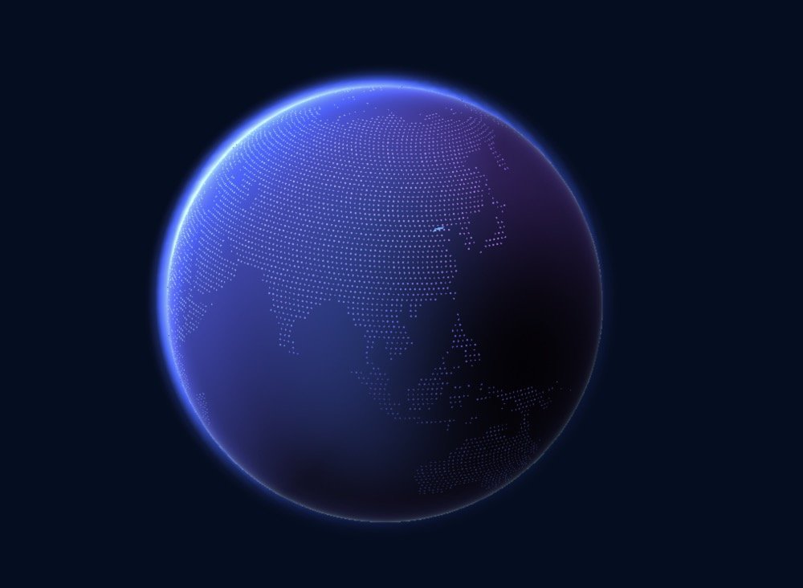

     
  # Getting started
  
```$xslt
npm install react-3d-earth
```
or 
```$xslt
yarn add react-3d-earth
```
  
```$xslt
import React from "react";
import React3dEarth from 'react-3d-earth'
```


```$xslt
export const App = () => <div>
    <React3dEarth
        style={{width: '100%', height: '100vh',position:'absolute',zIndex:'0'}}
</di>
```
or 
```$xslt
export const App = () => <div>
    <React3dEarth
        style={{width: '100%', height: '100vh',position:'absolute',zIndex:'0'}}
        config={{
          // radius: 30,
          // backgroundColor: '#fafafa',
          // flagScale:1,
          // flagLat:39.56,
          // flagLon: 116.20,
          // flagColor: 'green'
          // dotColor: 'hotpink'
          // autoRotationSpeed: 3,
          // draggingRotationSpeed:5,
          // textureSrc: '/images/map.png'
        }}/>
</div>
```
## config
| porp | type | default | 备注 |
| --- | --- | --- | --- |
| radius | number | 20 | 地球半径大小 |
| textureSrc | string | '' | 自定义地图纹理地址  |
| backgroundColor | string | #040d21 | 背景颜色 |
| flagScale | number | 1 | 旗子放大倍数 |
| flagLat | number | 39.56 | 旗子在地球上的纬度 |
| flagLon | number | 116.20 | 旗子在地球上的经度 |
| flagColor | string |  | 旗子颜色 |
| dotColor | string |  | 地球上点的颜色 |
| autoRotationSpeed | number | 0.15 | 自动转动的速度 |
| draggingRotationSpeed | number | 3 | 拖动时转动的速度 |


## demo

<https://www.haoolee.com>


 
